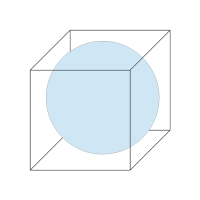

% Having fun with YouTube's Content ID
% Loïc Banet;
  Gaël Gilet--Couraud;
  Guillaume Marques
% December 8, 2017

# Having fun with Content ID

How to bypass YouTube's Content ID without major visual artifacts.

# What is YouTube's Content ID

* Youtube's tool to manage copyright.
* Owners of copyrighted content identify it and manage it through this tool.
* Videos uploaded to YouTube are compared against audio and video files.
* In case of copyright infringement, the acces to the video is blocked for
  related countries.

# What we tried to do

* Focus on the video analysis part of content ID.
* Find a way to bypass it while keeping the video similar to the original one.

# Solution

* **360° video**.
* Original video is embedded inside.
* Noise around to fool the tool.

# 360° video (YouTube)

* Like a normal video with equirectangle frames.

# Equirectangular projection

* Map the surface of a sphere to a flat image.
* Aspect ratio of 2:1 (width/height ratio).
* For example the plane chart of the world.

# Plane chart

# Cubemap

* Cube of pictures
* Composed of 6 pictures, 1 for each face: top, bottom, left, right, front, back
* The viewer is supposed to be at the center of the cube.

# Cubemap Example

# Conversion principles

* Spherical map
* Embed a sphere in the cubemap and project rays froms the center
  to the sphere.
* Apply the equirectangular projection. (spherical coordinates to carthesian)

# Cubemap to equirectangle

# Cubemap Example

# Equirectangle Example

# Stealth converter principle

* Convert each frame of the video in equirectangle.
* Add noise around the equirectangle frame.
* Reassemble the frames in a video.

# Problem

* Heavy operation to compute.
* Takes too much time.

# Solution

* Program designed to be distributable.
* Distributed to multiple machines.
* Multithreaded.

# Flow of the program

* Split the video in sub-videos.
* Distrubute the sub-videos.
* Split the sub-videos into frames.
* Convert each frame.
* Reassemble each frame into converted sub-videos.
* Send back the sub videos to the main machine.
* Reassemble the complete video.

# Splitting and Reassembling into sub-videos

## FFmpeg

* Detect frame number of each iframe.
    * intra-coded frames, self-sufficient.
    * Complete images, as opposed to Pframes and Bframes.
    * Useful to process each iframe in any order (multithreaded).

## OpenCV

* Split the video from the previous iframe, up to the next one.
* We have as many sub-videos as there are iframes.

# Distributing to multiple machines

* **Task queue**
* Job schueduler, contains list of jobs to send to clients.

# Performance gain with this method

* Multithreading: 3.7 times speedup.
* Multiple runners: 5 times speedup.
* More than **18** times faster.

# Results

* Video sucessfully uploaded.
* Sufficient to put the original video frame in the top part of the
  cubemap without noise.

# Conclusion

* Base code available here: **github.com/Tauril/stealth-converter**

* Any Questions?
