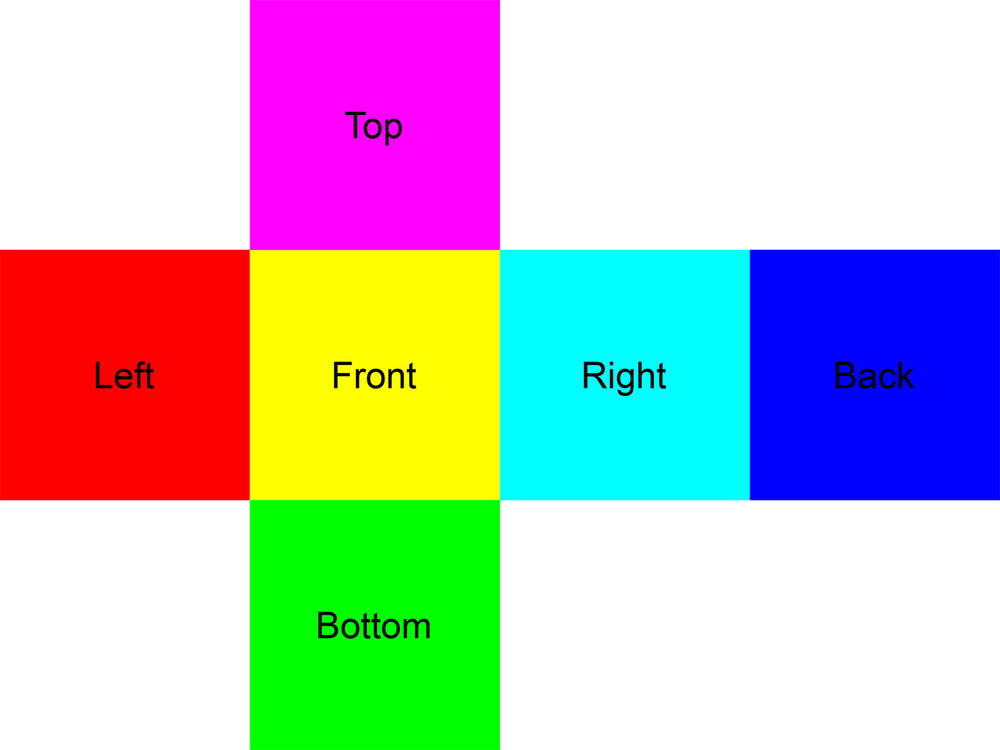
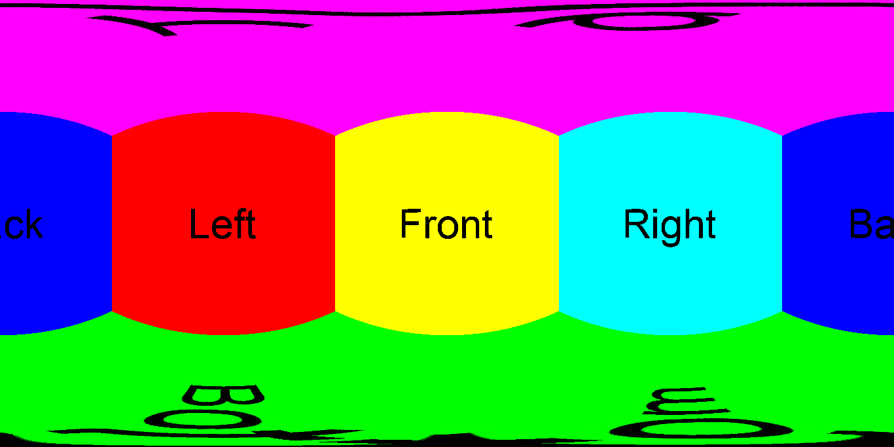

# Having fun with Content ID

How to bypass YouTube Content ID without major visual artifacts.

# What is YouTube's Content ID

* Youtube's tool to manage copyright.
* Owners of copyrighted content identify it and manage it through this tool.
* Videos uploaded to YouTube are compared against audio and video files.
* In case of copyright infringement, the acces to the video is blocked for
  related countries.

# What we tried to do

* Focus on the video analysis part of content ID.
* Find a way to bypass it while keeping the video similar to the original one.

# Solution

* 360° video.
* Original video is embedded inside.
* Noise around to fool the tool.

# 360° video (YouTube)

* Like a normal video with equirectangle frames.

# Cubemap

* Cube of pictures, where the user is inside.
* Composed of 6 pictures, 1 for each face: top, bottom, left, right, front, back

# Cubemap Example

# Equirectangular projection

* Equidistant cylindrical projection.
* Usually converted from a cubemap.
* Apply deformation to the faces to get an equirectangle.

# Equirectangle Example

# Stealth converter principle

* Convert each frame of the video in equirectangle.
* Add noise around the equirectangle frame.
* Reassemble the frames in a video.

# Problem

* Heavy operation to compute.
* Takes too much time.

# Solution

* Program designed to be distributable.
* Multithreaded.
* Distributed to multiple machines.

# Flow of the program

* Split the video in sub-videos.
* Distrubute the sub-videos.
* Split the sub-videos into frames.
* Convert each frame.
* Reassemble each frame into converted sub-videos.
* Send back the sub videos to the main machine.
* Reassemble the complete video.

# Splitting and Reassembling into sub-videos

* FFmpeg
  * Detect frame number of each iframe
    * intra-coded frames, self-sufficient
    * Complete images, as opposed to Pframes and Bframes
    * Useful to process each iframe in any order (multithreaded)
* opencv
  * Split the video from the previous iframe, up to the next one
  * We have as many sub-videos as there are iframes

# Distributing to multiple machines

FIXME

# Conversion principles

FIXME

# Performance gain with this method

FIXME

# Results

FIXME
